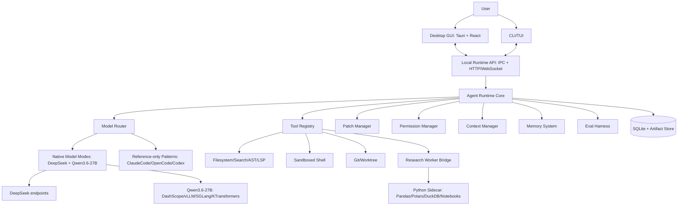
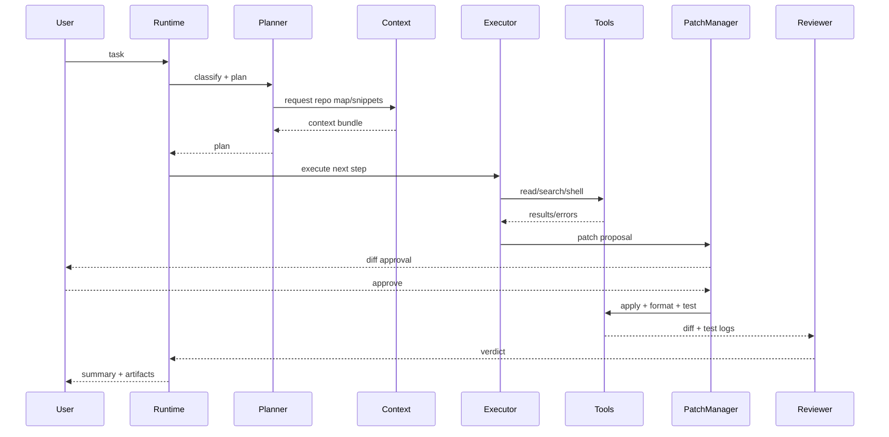

# 08 Target Product Architecture

Product name: ResearchCode Coworker.

## A. Product Positioning

One sentence:
- A local-first AI agent workbench for software engineering and research teams, combining coding-agent runtime, GUI command center, research/data workflows, model routing, and auditable automation.

## A1. Overall Architecture



Architecture Decision:
- Recommended stack is Option A: Tauri + React GUI, Rust runtime/CLI, Python research sidecar, SQLite, IPC/local RPC.
- GUI and CLI must not write SQLite directly. They read and mutate product state through Runtime API commands and event subscriptions. Runtime/storage owns SQLite migrations, transactions, permission gates, and append-only event consistency.

## A2. Module Layers

1. Presentation: Desktop GUI, CLI/TUI, local web/debug UI.
2. Runtime API: command/event protocol, auth, local-only binding.
3. Agent Runtime: state machine, sessions, plans, tools, permissions, patching, worktrees.
4. Model Layer: providers, profiles, router, parsers, retries, eval feedback.
5. Tool Layer: file/search/AST/shell/git/browser/data/report/MCP.
6. Research Worker: Python sandbox, data profiling, notebooks, reports, charts.
7. Storage: SQLite metadata, artifact store, session logs, memory.
8. Extension: skills, hooks, plugins, automations.

## A3. Local-First Architecture

Recommendation:
- All project files, sessions, tool logs, diffs, artifacts, and memories live locally by default.
- Cloud model calls send only the model context bundle, which must be inspectable in dev mode.
- Team/cloud extension later syncs selected task metadata/artifacts with policy controls.

## A4. Single-User vs Team Edition

Single-user local:
- Tauri app starts local Rust runtime.
- Runtime binds to localhost or IPC only.
- SQLite under app data plus per-project `.researchcode/`.
- Python sidecar spawned on demand.

Team edition:
- Local runtime remains authoritative for filesystem actions.
- Cloud control plane stores users, projects, task assignments, policy, shareable artifacts.
- Remote approvals and audit logs are possible, but filesystem writes still occur through local runtime or managed runners.

## B. Core Modules

### 1. Desktop GUI

Responsibilities:
- Project list/dashboard.
- Task board and multi-agent lanes.
- Agent session timeline/log stream.
- Diff review and patch approval.
- Command/network/file approval queue.
- File tree and context picker.
- Model/profile selector.
- Research workspace, data table, chart and report viewers.
- Session history, settings, eval dashboard, observability.

Input:
- Runtime events, SQLite views, user actions.

Output:
- Start/stop/cancel tasks, approve/deny permissions, edit plans, apply/revert patches, select context, configure models.

First version:
- Project list, session view, logs, approvals, diff viewer, model selector.

Later:
- Team boards, remote approvals, artifact sharing, custom dashboards.

### 2. Agent Runtime

Responsibilities:
- `AgentSession`, `AgentStateMachine`, planner, executor, reviewer, tool dispatcher, context manager, permission manager, patch manager, worktree manager, memory manager, task manager, error recovery.

Inspired by:
- ClaudeCode `src/query.ts`, `src/Tool.ts`, compaction and permissions.
- OpenCode `session/prompt.ts`, `processor.ts`, `session.sql.ts`.
- ClawCode `ConversationRuntime`.

Output:
- Durable `AgentEvent` stream.

### 3. CLI / TUI

Responsibilities:
- `researchcode` command starts in current directory.
- Supports one-shot prompt, interactive loop, JSON output, resume session, attach to runtime.
- Uses the same runtime API as GUI.

### 4. Model Router

Responsibilities:
- Provider abstraction, model profile, task classifier, role routing, fallback, retry, cost/latency/local-cloud routing, eval feedback.

Architecture Decision:
- The user selects a native family mode first: DeepSeek or Qwen3.6-27B.
- Roles are then assigned to profiles inside that selected family. ClaudeCode/OpenCode/Codex are scaffold and eval references, not silent fallback targets.

### 5. Model Profiles

Profile fields:
- strengths, weaknesses, recommended roles, forbidden roles, prompt template, tool-use rules, context budget, output format, parser, error recovery, review strategy, eval metrics.

Native profiles:
- DeepSeek V4: long-context planner/researcher, strong reasoning, DeepSeek-specific thinking/tool handling, Pro/Flash role split.
- Qwen3.6-27B: agentic coding, repository-level reasoning, thinking/non-thinking/preserve-thinking modes, Qwen parser-aware tool use, local or OpenAI-compatible deployment.

Reference profiles:
- ClaudeCode/Claude: primary reference for model-shaped scaffolding: provider ID mapping, capability gating, thinking policy, prompt caching, stable tool schema, tool-result pairing repair, context/output caps, plan-mode routing.
- OpenCode/Codex-style systems: reference for open runtime, TUI/server architecture, provider abstraction, and eval baselines.

Architecture Decision:
- The first product's native code-agent serving endpoints are DeepSeek and Qwen3.6-27B. ClaudeCode remains a first-class scaffold reference; other providers remain reference systems or future adapters unless the native scope is explicitly expanded.

### 6. Tool Registry

Tools:
- file read/write/search/ripgrep/AST/LSP.
- shell.
- git/worktree.
- patch/diff.
- browser/web optional.
- data analysis: Python, notebook, Pandas/Polars/DuckDB.
- chart/report/literature/experiment organizer.
- MCP tools.

ToolSpec must include:
- schema, capabilities, read-only/destructive flags, permission requirement, path scope, output budget, concurrency, model compatibility, GUI renderer.

### 7. Context Manager

Context slots:
- user task, current plan, repo map, relevant snippets, git status/diff, tool results, compressed history, memory, research files, data schema, token budget, model policy.

Error handling:
- If model references unknown file: retrieve or reject.
- If context exceeds budget: compress by policy, not truncation.

### 8. Patch Manager

Flow:
- model edit proposal -> parse/validate -> diff preview -> conflict/stale/secret detection -> apply -> format -> test -> reviewer -> commit/merge.

Rollback:
- per-file backup, git worktree reset, patch revert.

### 9. Permission Manager

Policies:
- command approval.
- file write approval.
- network approval.
- sensitive path protection.
- destructive command block.
- secret detection.
- data privacy rules.
- per-project/team policy.

Default:
- workspace-write, ask for shell writes/network/destructive actions.

### 10. Worktree Manager

Responsibilities:
- branch/worktree creation, per-agent isolation, base commit tracking, dirty status, merge/rebase, conflict detection, rollback, GUI visualization.

### 11. Research Worker

Responsibilities:
- Python sandbox, CSV/Excel/JSON/Parquet profiling, data cleaning plans, script/notebook generation and execution, chart/report artifacts, experiment folder indexing, metadata extraction, literature parser, reproducibility assistant.

Architecture Decision:
- Research Worker is a peer to coding tools, not a plugin.

### 12. Eval Harness

Metrics:
- coding pass rate, patch apply success, build/test/lint pass, hallucinated file references, tool-call error rate, human approvals, token/cost/time, data-analysis correctness, chart/report artifact validity, model-specific failures.

### 13. Memory System

Stores:
- project memory, user preferences, model failure memory, repo facts, research project memory, experiment memory, long-term summaries.

Privacy:
- memory items have scope, sensitivity, source, and retention.

### 14. Skill / Automation

Capabilities:
- reusable coding/research/data workflows, scheduled tasks, hooks, pre/post command automations, project-specific skills.

### 15. Logging / Observability

Logs:
- task log, tool call log, model call log, token/cost, error, eval, audit, permission.

Storage:
- local SQLite plus artifact files.

## C. Key Data Flows

### Coding Task Flow



### GUI Multi-Agent Flow

User creates tasks -> Task Manager -> Worktree Manager creates isolated branches -> Agent sessions run -> GUI streams logs/diffs/approvals -> approved patches merge -> final result summary.

### Research Data Flow

User selects data -> schema scan -> data quality report -> cleaning plan -> Python script/notebook -> execution -> chart artifacts -> Markdown/PDF/LaTeX report -> reviewer.

### Model Routing Flow

Task classification -> role split -> profile selection -> prompt assembly -> model call -> parser/repair -> tool execution -> review -> eval logging -> profile update suggestion.

### Error Recovery Flow

Failure -> classify error -> retrieve missing context -> propose fix -> retry with limit -> reviewer -> human escalation if repeated or destructive.

### Long Context Flow

Repo map + relevant files + tool outputs + memory -> model-specific budgeter -> compression or artifact reference -> next context bundle -> memory update.

## D. Agent State Machine

| State | Input | Output | Tools | Transitions | GUI | Error Handling |
|---|---|---|---|---|---|---|
| Created | Task | Session row | none | Planning/Cancelled | task card | invalid task -> Failed |
| Planning | Task/context | Plan | read/search | WaitingForPlanApproval/RetrievingContext | plan panel | planner fail -> retry/fallback |
| WaitingForPlanApproval | Plan | decision | none | RetrievingContext/WaitingForUser/Cancelled | approval banner | timeout -> WaitingForUser |
| RetrievingContext | Plan step | ContextBundle | read/search/AST/git | Executing/Planning | context drawer | missing file -> refresh |
| Executing | Context/plan | tool calls/patches | allowed tools | WaitingForToolApproval/ApplyingPatch/RunningCommand/Reviewing | live log | tool error -> DiagnosingFailure |
| WaitingForToolApproval | PermissionRequest | decision | none | RunningCommand/ApplyingPatch/Executing/WaitingForUser | approval queue | deny -> model feedback |
| ApplyingPatch | PatchProposal | applied diff | file/patch/git | RunningCommand/Reviewing | diff viewer | conflict -> DiagnosingFailure |
| RunningCommand | command | logs/exit | shell | Executing/DiagnosingFailure/Reviewing | terminal card | timeout/nonzero -> diagnose |
| DiagnosingFailure | error/logs | diagnosis/fix plan | read/search/shell | Executing/WaitingForUser/Failed | failure panel | retry budget exceeded -> Failed |
| Reviewing | diff/logs | verdict | read/search/test | Completed/Executing/WaitingForUser | review panel | reviewer fail -> fallback |
| WaitingForUser | question | user input | none | Planning/Executing/Cancelled | prompt | stale session -> refresh |
| Completed | final result | artifacts | none | none | completion | none |
| Failed | error | failure artifact | none | none | failure summary | user can fork/retry |
| Cancelled | cancel | stopped | cancellation | none | cancelled | cleanup worktree |

## E. Core Interface Drafts

```ts
type AgentState =
  | "Created" | "Planning" | "WaitingForPlanApproval" | "RetrievingContext"
  | "Executing" | "WaitingForToolApproval" | "ApplyingPatch" | "RunningCommand"
  | "DiagnosingFailure" | "Reviewing" | "WaitingForUser"
  | "Completed" | "Failed" | "Cancelled";

interface AgentSession {
  id: string; projectId: string; taskId: string; state: AgentState;
  cwd: string; worktreeId?: string; modelPlan: ModelRoutePlan;
  createdAt: string; updatedAt: string;
  createdBy: "gui" | "cli" | "automation";
  persistence: "sqlite";
}

interface AgentEvent {
  id: string; sessionId: string; type: string; payload: unknown;
  createdAt: string; visible: boolean; severity?: "info" | "warn" | "error";
}

interface Task {
  id: string; projectId: string; title: string; description: string;
  kind: "coding" | "research" | "data" | "review" | "automation";
  status: "queued" | "running" | "blocked" | "done" | "failed";
  priority: number; createdAt: string;
}

interface Plan { id: string; taskId: string; steps: PlanStep[]; approvedAt?: string; }
interface PlanStep { id: string; title: string; status: "pending" | "running" | "done" | "blocked"; ownerRole: string; expectedTools: string[]; }

interface ToolCall {
  id: string; sessionId: string; name: string; input: unknown;
  status: "pending" | "awaiting_permission" | "running" | "success" | "error" | "cancelled";
  permissionRequestId?: string; resultId?: string; startedAt?: string; finishedAt?: string;
}

interface ToolResult { id: string; toolCallId: string; outputPreview: string; artifactUri?: string; isError: boolean; metrics?: Record<string, unknown>; }

interface ModelMessage { role: "system" | "developer" | "user" | "assistant" | "tool"; content: unknown; tokenEstimate?: number; }

interface ModelProfile {
  id: string; provider: string; model: string;
  family: "deepseek" | "qwen"; modeId: "deepseek-v4" | "qwen3.6-27b";
  deployment: { stack: "api" | "dashscope" | "vllm" | "sglang" | "ktransformers" | "transformers"; endpoint: string; parserFlags: string[] };
  roles: string[];
  strengths: string[]; weaknesses: string[]; forbiddenRoles: string[];
  contextBudget: { maxTokens: number; reserveOutputTokens: number; compactAt: number };
  generation: Record<string, { temperature: number; topP: number; topK?: number; minP?: number; presencePenalty?: number; repetitionPenalty?: number; maxTokens: number; thinking: "on" | "off"; preserveThinking?: boolean }>;
  promptTemplateId: string; toolUseRules: string[]; outputParser: string;
  retryPolicy: RetryPolicy; evalMetrics: string[];
}

interface ModelRouter { route(input: RoutingInput): Promise<ModelRoutePlan>; record(result: EvalResult): Promise<void>; }
interface ModelProvider { id: string; call(request: ModelRequest): AsyncIterable<ModelStreamEvent>; }

interface ContextBundle { id: string; sessionId: string; modelProfileId: string; items: ContextItem[]; tokenEstimate: number; }
interface ContextItem { id: string; kind: string; source: string; contentRef?: string; text?: string; priority: number; sensitivity: "public" | "project" | "secret"; }

interface PatchProposal { id: string; sessionId: string; files: PatchFile[]; rationale: string; status: "proposed" | "approved" | "applied" | "rejected" | "conflict"; }
interface DiffView { id: string; patchId: string; unifiedDiff: string; stats: { added: number; removed: number; files: number }; }

interface PermissionRequest { id: string; sessionId: string; toolCallId: string; kind: "command" | "file_write" | "network" | "secret" | "destructive"; subject: string; reason: string; policy: string; }
interface PermissionDecision { id: string; requestId: string; decision: "allow_once" | "always_allow" | "deny" | "modify"; actor: string; createdAt: string; }

interface WorktreeSession { id: string; projectId: string; path: string; branch: string; baseCommit: string; ownerSessionId?: string; status: "ready" | "dirty" | "conflict" | "merged" | "removed"; }

interface ResearchJob { id: string; projectId: string; taskId: string; kind: "profile" | "clean" | "analyze" | "report" | "reproduce"; status: string; inputs: string[]; artifacts: string[]; }
interface DataProfile { id: string; datasetUri: string; rows?: number; columns: DataColumn[]; qualityFindings: string[]; }
interface AnalysisScript { id: string; jobId: string; language: "python" | "sql"; path: string; status: string; }
interface ChartArtifact { id: string; jobId: string; path: string; specPath?: string; title: string; }
interface ReportArtifact { id: string; jobId: string; path: string; format: "md" | "pdf" | "tex" | "docx"; }

interface EvalCase { id: string; kind: string; prompt: string; fixtureUri: string; expected: unknown; }
interface EvalResult { id: string; caseId: string; modelProfileId: string; success: boolean; metrics: Record<string, number>; failures: string[]; }

interface Skill { id: string; name: string; kind: "coding" | "research" | "data" | "automation"; manifestPath: string; permissions: string[]; }
interface MemoryItem { id: string; scope: "user" | "project" | "session" | "model" | "research"; text: string; source: string; sensitivity: string; createdAt: string; }
interface LogEvent { id: string; scope: string; level: string; message: string; payload?: unknown; createdAt: string; }
```

Type lifecycle matrix:

| Type | Key fields | Role | Created by | Consumed by | Lifecycle | Persistence |
|---|---|---|---|---|---|---|
| `AgentSession` | id, projectId, taskId, state, cwd, worktreeId, modelPlan | Runtime execution container | Task Manager / Runtime | GUI, CLI, Runtime, Eval | Created -> state transitions -> Completed/Failed/Cancelled -> archived | `sessions` |
| `AgentState` | enum value | Legal runtime state | State machine | Runtime API, GUI | Changes only through transition guards | `sessions.state`, `agent_events` |
| `AgentEvent` | id, sessionId, type, payload, severity | Append-only timeline | Runtime modules | GUI, CLI, observability, eval | Appended during runtime actions; never rewritten except redaction metadata | `agent_events` |
| `Task` | id, projectId, kind, status, priority | User work item | GUI/CLI/Automation | Task Manager, Runtime | Queued -> running/blocked -> done/failed | `tasks` |
| `Plan` | id, taskId, steps, approvedAt | Planner contract | Planner | Executor, GUI, Reviewer | Draft -> approved/revised -> completed | `plans` or plan artifact in v1 |
| `PlanStep` | id, status, ownerRole, expectedTools | Executable unit | Planner | Executor, GUI | Pending -> running -> done/blocked | `plan_steps` or plan JSON in v1 |
| `ToolCall` | id, name, input, status, permissionRequestId | Concrete tool invocation | Executor / Tool Dispatcher | Permission Manager, Tool Registry, GUI | Pending -> approval/running -> success/error/cancelled | `tool_calls` |
| `ToolResult` | outputPreview, artifactUri, metrics | Tool output returned to model/UI | Tool Registry | Context Manager, Model Adapter, GUI | Created after tool exits; large output externalized | `tool_results`, `artifacts` |
| `ModelMessage` | role, content, tokenEstimate | Transcript item | Context Manager / Model Adapter | Model Provider, storage, replay | Built per call; persisted if transcript-relevant | `messages`, artifacts for large blocks |
| `ModelProfile` | family, modeId, deployment, generation, parser | Native model capability contract | ModelProfile Registry | ModelRouter, Context Manager, Model Adapter, Eval | Versioned; updated by eval suggestions, never silently mutated | built-in registry + `settings` |
| `ModelRouter` | route(), record() | Role/profile selector | Runtime service | Agent Runtime | Stateless over profiles and eval memory | code + `eval_results`/settings |
| `ModelProvider` | id, call() | Endpoint adapter | Model layer | ModelRouter/Runtime | Configured at startup/settings change | `settings`, `model_calls` |
| `ContextBundle` | items, tokenEstimate, modelProfileId | Model input package | Context Manager | Model Adapter, Eval, dev inspector | Built per model call; compacted/snapshotted | `model_calls.context_artifact_uri` or `context_bundles` |
| `ContextItem` | kind, source, priority, sensitivity | Atomic context unit | Context Manager/tools/memory | Context Budgeter, Model Adapter | Created/reordered/compacted per call | embedded in context artifact |
| `PatchProposal` | files, rationale, status | Proposed file change | Executor/Patch Manager | GUI/CLI approval, Reviewer | Proposed -> approved/rejected -> applied/conflict/reverted | `patches`, `patch_files`, diff artifact |
| `DiffView` | patchId, unifiedDiff, stats | Review projection | Patch Manager | GUI/CLI | Generated from patch; regenerated on conflict | `artifacts` + patch stats |
| `PermissionRequest` | kind, subject, reason, policy | Human/policy gate | Permission Manager | GUI/CLI/remote approval | Pending -> decided/expired/cancelled | `permissions` |
| `PermissionDecision` | decision, actor, scope | Approval audit record | GUI/CLI/policy engine | Permission Manager, audit log | Immutable once recorded | `permission_decisions` |
| `WorktreeSession` | path, branch, baseCommit, status | Per-agent isolation | Worktree Manager | Runtime, GUI, Git tools | Ready -> dirty/conflict -> merged/removed | `worktrees` |
| `ResearchJob` | kind, inputs, artifacts, status | Research workflow unit | Research Worker / Task Manager | GUI, ModelRouter, Eval | Created -> running -> completed/failed | `research_jobs` |
| `DataProfile` | datasetUri, schema, quality | Structured dataset facts | Research Worker | GUI, model context, reports | Created after profiling; refreshed when data hash changes | `data_profiles` |
| `AnalysisScript` | path, language, status | Reproducible computation artifact | Research Worker / model executor | Python sandbox, GUI, reports | Draft -> approved -> executed -> archived | `artifacts`, script path |
| `ChartArtifact` | path, specPath, title | Visual result | Research Worker | GUI/report writer | Created from script; validated non-empty | `artifacts` |
| `ReportArtifact` | path, format | Research/coding summary output | Research Worker / Reporter | GUI/export | Draft -> reviewed -> exported | `artifacts` |
| `EvalCase` | kind, fixtureUri, expected | Test fixture | Eval Harness | Eval runner | Versioned; never mutated in-place | `eval_cases` or repo fixtures |
| `EvalResult` | modelProfileId, metrics, failures | Quality signal | Eval runner/runtime telemetry | ModelRouter, dashboard | Appended per run/call | `eval_results` |
| `Skill` | manifestPath, permissions | Reusable workflow package | Skill manager | Runtime, GUI settings | Installed -> enabled/disabled -> removed | `skills`/settings |
| `MemoryItem` | scope, text, source, sensitivity | Long-term fact/preference | Memory Manager / user | Context Manager, GUI | Proposed -> accepted -> retrieved -> expired/redacted | `memories` |
| `LogEvent` | scope, level, payload | Observability record | Any module | Logs UI, diagnostics | Append-only with retention policy | `logs` or scoped `agent_events` |

Storage rule:
- SQLite stores metadata, indexes, statuses, hashes, and artifact URIs. Large prompts, tool outputs, diffs, notebooks, charts, datasets, and reports live in the artifact store with content hashes.
- Runtime API is the only write path. GUI/CLI submit commands and decisions; storage transactions happen inside runtime/storage modules.

## F. Technical Stack Evaluation

| Option | Strengths | Weaknesses | Verdict |
|---|---|---|---|
| A: Tauri+React, Rust runtime/CLI, Python sidecar, SQLite, IPC/local RPC | Strong local safety, small desktop app, Rust good for shell/files/worktrees, Python best for research data, long-term maintainable, good commercial packaging | Slower initial development than full TS, Rust/TS/Python boundary complexity | Recommended |
| B: Electron+React, Node runtime/CLI, Python sidecar | Fast development, OpenCode patterns directly portable, huge ecosystem | Larger app, weaker local sandbox discipline, Node shell security harder, commercial distribution heavier | Good prototype, weaker long-term |
| C: Tauri+React, TypeScript service, Node CLI, Python | Good GUI footprint and TS runtime speed | Two runtimes plus IPC complexity, local permission boundary weaker than Rust | Acceptable if team is TS-heavy |
| D: Python-first backend | Best research/data convenience | Weak desktop/runtime/shell safety, packaging complexity, coding-agent runtime less robust | Not recommended |

Final recommendation:
- Option A.

## G. Storage Architecture

SQLite tables:

| Table | Key Fields | Relationships |
|---|---|---|
| `projects` | id, name, root_path, git_root, created_at, settings_json | owns tasks/sessions/memories |
| `tasks` | id, project_id, title, description, kind, status, priority | project -> task -> sessions |
| `sessions` | id, project_id, task_id, state, cwd, worktree_id, model_route_json, created_at, updated_at | has messages/events/tool_calls |
| `plans` | id, task_id, session_id, status, approved_at, plan_json, created_at | task/session plan contract |
| `plan_steps` | id, plan_id, title, status, owner_role, expected_tools_json, order_index | executable plan units |
| `worktrees` | id, project_id, path, branch, base_commit, owner_session_id, status | per-agent isolation |
| `messages` | id, session_id, role, content_json, token_estimate, parent_id, created_at | model transcript |
| `context_bundles` | id, session_id, model_call_id, profile_id, token_estimate, items_artifact_uri, created_at | model input package replay |
| `agent_events` | id, session_id, type, payload_json, severity, created_at | event log |
| `tool_calls` | id, session_id, message_id, name, input_json, status, timestamps | has tool_results/permissions |
| `tool_results` | id, tool_call_id, preview, artifact_uri, is_error, metrics_json | tool call output |
| `patches` | id, session_id, status, rationale, diff_artifact_uri, stats_json | has patch_files |
| `patch_files` | id, patch_id, path, old_hash, new_hash, status | per-file diff |
| `permissions` | id, session_id, tool_call_id, kind, subject, reason, policy, status | has decisions |
| `permission_decisions` | id, permission_id, actor, decision, scope, created_at | approval audit |
| `model_calls` | id, session_id, mode_id, profile_id, provider, model, adapter_version, deployment_stack, parser_flags_json, thinking_settings_json, prompt_template_hash, tool_schema_hash, context_tokens, input_tokens, output_tokens, cost, latency_ms, status, request_artifact_uri, response_artifact_uri | eval/cost/debug/replay |
| `eval_results` | id, case_id, session_id, profile_id, success, metrics_json, failures_json | model tuning |
| `eval_cases` | id, kind, fixture_uri, expected_json, version, enabled | eval fixtures/catalog |
| `memories` | id, scope, project_id, text, source, sensitivity, created_at, updated_at | memory retrieval |
| `research_jobs` | id, project_id, task_id, kind, status, inputs_json, created_at | has artifacts |
| `data_profiles` | id, research_job_id, dataset_uri, schema_json, quality_json | research |
| `artifacts` | id, project_id, session_id, kind, uri, mime, title, metadata_json | linked from many |
| `skills` | id, name, kind, manifest_path, enabled, permissions_json, created_at | reusable workflows |
| `settings` | id, scope, scope_id, key, value_json, updated_at | config hierarchy |
| `logs` | id, scope, level, message, payload_json, created_at | non-session observability |

## H. GUI Information Architecture

1. Home / Project list: manage roots, recent tasks, health; source `projects`.
2. Project dashboard: branch status, task summary, recent artifacts; source `projects/tasks/sessions`.
3. Task board: columns queued/running/blocked/done; actions start/fork/cancel.
4. Agent session view: timeline, plan sidebar, tool logs, model calls, context bundle.
5. Diff review panel: file list, unified/side-by-side diff, approve/reject/apply/revert.
6. Command approval panel: command, cwd, env, risk classification, allow once/deny.
7. File explorer: repo tree, selected context, git status, read snippets.
8. Research workspace: data files, jobs, profiles, reports, notebooks.
9. Data analysis view: schema, quality, table preview, script, charts.
10. Report viewer: Markdown/PDF/LaTeX preview and export artifacts.
11. Model profiles settings: native DeepSeek/Qwen deployments, roles, costs, eval scores, same-family fallback.
12. Eval dashboard: pass rates, tool errors, cost/time, profile comparisons.
13. Logs / observability: runtime, model, tool, audit logs.
14. Settings: projects, permissions, hooks, skills, storage, privacy.

First version:
- Home, Project dashboard, Task board, Session view, Diff review, Command approval, Model settings.

## I. Research Coworker Link

Detailed in `09_research_coworker_architecture.md`.

## J. Model Optimization Link

Detailed in `10_model_optimization_architecture.md`.
