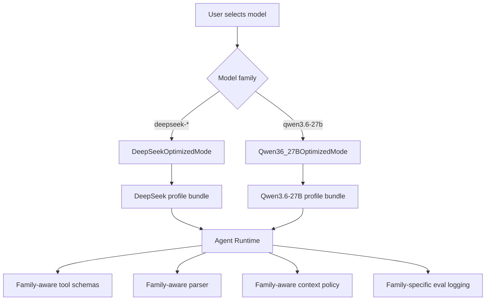

# 15 Native DeepSeek and Qwen3.6-27B Modes

## Core Product Constraint

Architecture Decision:
- ResearchCode Coworker code agent is natively optimized for exactly two model families in the first product line: **DeepSeek** and **Qwen3.6-27B**.
- ClaudeCode is a first-class architectural and model-adaptation reference. The product must absorb how ClaudeCode tunes its agent scaffold for Claude: model capability gating, thinking policy, stable tool schemas, provider-specific IDs, prompt caching, tool-result pairing repair, context limits, and role-specific model selection.
- ClaudeCode's value here is not "just another provider". It is the blueprint for how to build a model-shaped agent runtime. We translate that pattern into `DeepSeekOptimizedMode` and `Qwen36_27BOptimizedMode`.
- When the user selects a DeepSeek model, the runtime enters `DeepSeekOptimizedMode`.
- When the user selects Qwen3.6-27B, the runtime enters `Qwen36_27BOptimizedMode`.
- Cross-family fallback is disabled by default. A Qwen session should not silently fall back to DeepSeek, and a DeepSeek session should not silently fall back to Qwen unless the user explicitly enables cross-family fallback.

## External Qwen Sources Used

Primary target:
- `Qwen/Qwen3.6-27B` is the Qwen native target for this product: https://huggingface.co/Qwen/Qwen3.6-27B

Observed from Hugging Face `Qwen/Qwen3.6-27B`:
- The model card describes Qwen3.6-27B as a post-trained 27B model aimed at stability, real-world utility, coding experience, agentic coding, and repository-level reasoning.
- It explicitly lists "Agentic Coding" and "Thinking Preservation" as Qwen3.6 highlights.
- It reports 27B parameters and a context length of 262,144 tokens natively, extensible up to about 1,010,000 tokens with long-context configuration.
- It recommends API deployment through SGLang, vLLM, KTransformers, Transformers, and OpenAI-compatible APIs.
- For SGLang/vLLM tool use, it shows Qwen-specific reasoning and tool-call parser flags such as `--reasoning-parser qwen3` and `--tool-call-parser qwen3_coder`.
- It recommends maintaining at least 128K context where possible to preserve thinking capability.
- It recommends sampling parameters by mode: thinking/general, thinking/precise coding, and non-thinking/instruct.
- Qwen3.6 thinks by default and can disable thinking via API parameters; it also supports `preserve_thinking` for historical reasoning context.
- It recommends Qwen-Agent and mentions Qwen Code as agentic usage paths.

Observed from Qwen official function-calling docs:
- Source: https://qwen.readthedocs.io/en/v2.0/framework/function_call.html
- Qwen function calling depends on chat templates, function schemas, and parser/framework support, not just a generic OpenAI-compatible client.
- Tools/functions are represented with JSON Schema-like definitions.
- Qwen-Agent is positioned as the canonical agent wrapper for Qwen function calling.
- The prompt template uses explicit tool sections and tool-call tags in the Qwen convention.
- Some serving stacks require explicit Qwen parser/template configuration; OpenAI-compatible transport alone is not enough.

Observed from user-provided `Qwen/Qwen2-7B` URL:
- Treat the Qwen2-7B page as background on Qwen lineage and tokenizer/model behavior only.
- It is not the native target for this product and must not drive the default profile.

Recommendation:
- Default Qwen native mode must target Qwen3.6-27B.
- Qwen2/Qwen2-7B information can inform compatibility and historical design, but any runtime default, prompt, parser, eval threshold, and context policy must be written against Qwen3.6-27B.

## Native Runtime Mode Switch



Runtime selection rules:
- `model_family = deepseek` selects DeepSeek prompt, tool schema, parser, context, compaction, retry, and eval suite.
- `model_family = qwen` selects Qwen3.6-27B prompt, Qwen reasoning/tool parser, function-call template, context, retry, and eval suite.
- GUI must show the active mode visibly: `DeepSeek Mode` or `Qwen3.6-27B Mode`.
- All model call logs must record `mode_id`, `profile_id`, `adapter_version`, `prompt_template_hash`, `tool_schema_hash`, deployment stack, parser flags, context length, and thinking settings.

## DeepSeekOptimizedMode

Observed basis:
- DeepSeek-TUI implements V4 context, thinking replay/sanitizer, prefix-cache-aware prompt layering, sorted/memoized tool schemas, and JSON arg repair.
- DeepSeek V4 paper describes 1M advertised context, Think High/Max, DSML/XML tool schema, and interleaved thinking for tool-calling scenarios; ResearchCode keeps the default runtime cap at 256K until deployment-specific eval proves a higher safe window.

Responsibilities:
- Use native DeepSeek V4 tool-calling when available.
- Preserve/replay reasoning content according to provider requirements.
- Keep system prompt and tool schema byte-stable.
- Compact at the live-loop boundary: start DeepSeek compaction telemetry at 192K, target prepared requests below 240K, and block before 256K.
- Log cache hit/miss, reasoning replay tokens, tool-call repair rate.
- Support Pro/Flash role profiles inside the DeepSeek family.

Recommended DeepSeek roles:
- `deepseek-v4-pro-max`: planner, hard diagnosis, long research synthesis, final reviewer.
- `deepseek-v4-pro-high`: code executor, data script generator, build failure repair.
- `deepseek-v4-flash-high`: repo explorer, summarizer, cheap candidate generator.
- `deepseek-v4-nonthink`: simple status, summaries, low-risk transforms.

DeepSeek forbidden defaults:
- Do not simulate tools as user messages in thinking mode.
- Do not compact at low token counts just to make history short.
- Do not use Flash as sole final reviewer for high-risk code changes.

## Qwen36_27BOptimizedMode

Observed basis:
- Qwen3.6-27B model card positions the model for agentic coding, frontend workflows, repository-level reasoning, and thinking preservation.
- Qwen3.6-27B has a 262K native context window and can be extended to around 1.01M with long-context deployment configuration.
- Qwen3.6 thinking is enabled by default; non-thinking mode and preserve-thinking mode are controlled through API/deployment parameters.
- SGLang/vLLM deployment examples use Qwen-specific reasoning and tool-call parsers.
- Qwen function-calling docs show that the model needs Qwen-compatible templates/parsers; transport compatibility is insufficient.

Responsibilities:
- Use Qwen3.6-27B as the canonical Qwen checkpoint.
- Require an explicit Qwen parser/template adapter for tool use: `qwen3` reasoning parser plus `qwen3_coder` tool-call parser where the deployment stack supports it.
- Use Qwen chat-template semantics or a serving stack that faithfully implements them.
- Use JSON Schema tools with deterministic ordering, short tool names, required fields, enums, and examples.
- Separate thinking and non-thinking runtime modes:
  - Thinking mode for planning, diagnosis, reviewer, repository reasoning, and research synthesis.
  - Precise coding thinking mode for web/frontend/coding edits with lower temperature.
  - Non-thinking mode for simple status, mechanical summaries, and low-risk direct responses.
- Preserve thinking only when task continuity benefits from it and the deployment stack supports it; log the token/cost impact.
- Use the 262K context window for repo-level reasoning, but still prefer repo maps and targeted snippets over dumping files blindly.
- Long-context mode beyond 262K must be a deployment capability flag, not an assumption.
- Use patch-sized edits, stale-file detection, exact diff preview, tests, and reviewer loop even though Qwen3.6-27B is stronger than earlier smaller Qwen models.

Recommended Qwen3.6-27B roles:
- `qwen3.6-27b-thinking`: planner, diagnosis, code reviewer, research synthesis.
- `qwen3.6-27b-coding`: bounded code executor, frontend task executor, build/test repair.
- `qwen3.6-27b-long-context`: repo-level reasoning and long-document/research synthesis when 262K or extended context is deployed.
- `qwen3.6-27b-nonthink`: status updates, simple summaries, low-risk transforms.
- `qwen3.6-27b-research`: Chinese/English scientific assistant, data interpretation narrator, report drafter.

Qwen3.6-27B forbidden defaults:
- Do not treat Qwen2-7B or Qwen2-7B-Instruct behavior as the Qwen3.6-27B production profile.
- Do not assume generic OpenAI tool calling works unless the server is configured with Qwen-compatible parser/template behavior.
- Do not enable long context beyond 262K without verified YaRN/serving-stack configuration and eval.
- Do not bypass patch manager, permission manager, tests, or reviewer checks.
- Do not use non-thinking mode for complex planning, diagnosis, or multi-file repair.

## ClaudeCode's Claude Adaptation Pattern to Absorb

Observed in `Open-ClaudeCode-main/Open-ClaudeCode-main/src/utils/model/configs.ts`:
- ClaudeCode maintains canonical model configs for Claude families and maps them to provider-specific strings for first-party, Bedrock, Vertex, and Foundry.

Observed in `src/utils/model/model.ts`:
- Model selection is not a single dropdown value. It accounts for user overrides, environment variables, settings, defaults, plan mode, subscriber/default behavior, and aliases such as Opus/Sonnet/Haiku.

Observed in `src/utils/context.ts`:
- Context window and max output tokens are model-capability gated, including 1M context suffixes and beta headers.

Observed in `src/utils/thinking.ts` and `src/services/api/claude.ts`:
- Thinking support is model/provider-aware.
- Adaptive thinking is enabled only for supported models.
- Older thinking models use budget tokens.
- Temperature is omitted when thinking is enabled because the API expects default behavior.

Observed in `src/utils/toolSchemaCache.ts` and `src/utils/api.ts`:
- Rendered tool schemas are session-cached because byte-level drift busts prompt cache.
- Strict tools and eager input streaming are only sent if the model/provider supports them.
- Experimental tool schema fields are stripped by a kill switch for incompatible gateways.

Observed in `src/services/api/claude.ts`:
- Prompt cache markers are placed deliberately; beta headers are latched session-stably so mid-session feature flips do not bust cache keys.
- Tool-use/tool-result pairing is repaired before API submission.
- Model calls include output config, effort, task budget, context management, prompt caching, and model-specific beta headers.

What this means for our product:

| ClaudeCode Claude-shaped scaffold | DeepSeek translation | Qwen3.6-27B translation |
|---|---|---|
| Canonical Claude config plus provider-specific IDs | DeepSeek V4 Pro/Flash canonical roles plus endpoint-specific IDs | Qwen3.6-27B canonical profile plus DashScope/vLLM/SGLang/KTransformers IDs |
| Model-capability gated thinking | Think High/Max, reasoning replay, provider sanitizer | Thinking/non-thinking/preserve-thinking flags, parser-aware history policy |
| Stable tool schema bytes for cache | Sorted DSML/native tool catalog, prefix-cache metrics | Deterministic Qwen tool JSON, parser flag hash, template hash |
| Tool-use/tool-result pairing repair | Native tool result replay and DSML fallback repair | Qwen tool-call tag/parser repair and JSON argument normalization |
| Context/output caps per model | 256K safe cap, 240K request target, live compaction | 262K native policy, extended-context capability flag, at least 128K target where possible |
| Plan mode chooses stronger model | DeepSeek Pro-Max planner/reviewer | Qwen thinking planner/reviewer; non-thinking excluded from planning |
| Provider beta/header latching | DeepSeek cache/reasoning feature latching | Qwen deployment/parser/thinking flag latching |
| Kill switches for incompatible gateway fields | Disable DSML/strict mode when endpoint rejects it | Disable tool auto-choice/preserve-thinking/long context when stack rejects it |

Recommendation:
- Build the same adaptation pattern for DeepSeek and Qwen3.6-27B:
  1. `ModelFamilyConfig`: canonical model ID, provider-specific IDs, context/output caps.
  2. `CapabilityRegistry`: thinking, native tools, function-template tools, long context, strict schema, parallel calls.
  3. `ModeAdapter`: prompt template, context policy, tool schema serializer, parser, retry rules.
  4. `SessionStableCache`: stable tool schema/prompt/template bytes for the selected family.
  5. `FamilyEvalSuite`: tool-call validity, patch success, repair rate, context behavior.

## Native Mode Type Sketch

```ts
type NativeModelFamily = "deepseek" | "qwen";

type NativeModeId = "deepseek-v4" | "qwen3.6-27b";

interface NativeModeAdapter {
  family: NativeModelFamily;
  modeId: NativeModeId;
  selectRoleProfile(role: AgentRole, constraints: RoutingConstraints): ModelProfile;
  buildSystemPrompt(input: PromptInput): string | MessageBlock[];
  serializeTools(tools: ToolSpec[], capabilities: ModelCapabilities): SerializedToolCatalog;
  buildMessages(bundle: ContextBundle): ModelMessage[];
  parseAssistantOutput(raw: ModelRawOutput): ParsedAssistantTurn;
  repairToolCall?(raw: unknown, error: ToolParseError): ToolRepairResult;
  contextPolicy: ContextPolicy;
  retryPolicy: RetryPolicy;
  evalSuiteId: string;
}

interface ModelCapabilities {
  maxInputTokens: number;
  defaultOutputTokens: number;
  upperOutputTokens: number;
  nativeToolCalling: boolean;
  qwenFunctionTemplate: boolean;
  qwenReasoningParser: boolean;
  qwenToolCallParser: boolean;
  qwenPreserveThinking: boolean;
  deepseekReasoningReplay: boolean;
  stablePrefixCache: boolean;
  longContextRequiresDeploymentConfig?: boolean;
  supportsParallelToolCalls: boolean;
  supportsStrictSchema: boolean;
}
```

## Required Eval Split

DeepSeek evals:
- reasoning replay success;
- DSML/native tool-call parse rate;
- cache hit/miss;
- long-context retrieval;
- patch/test pass;
- Pro vs Flash role comparison.

Qwen3.6-27B evals:
- Qwen parser availability check by deployment stack;
- reasoning parser and tool-call parser fixture pass rate;
- thinking vs non-thinking role comparison;
- preserve-thinking continuation benefit and token cost;
- function-call template parse rate;
- Qwen-Agent vs direct parser comparison;
- parallel function call correctness where supported;
- patch-sized edit success;
- repo-level reasoning at 128K/262K contexts;
- extended-context YaRN on/off comparison where deployed;
- Qwen2 checkpoint mismatch guard to prevent using the wrong model profile.

Architecture Decision:
- A model is not promoted to a role until its family-specific eval suite passes the role threshold.
- Qwen3.6-27B is not treated as a generic local model. It gets its own native mode with dedicated prompt, parser, context, thinking, deployment, and eval policies.
