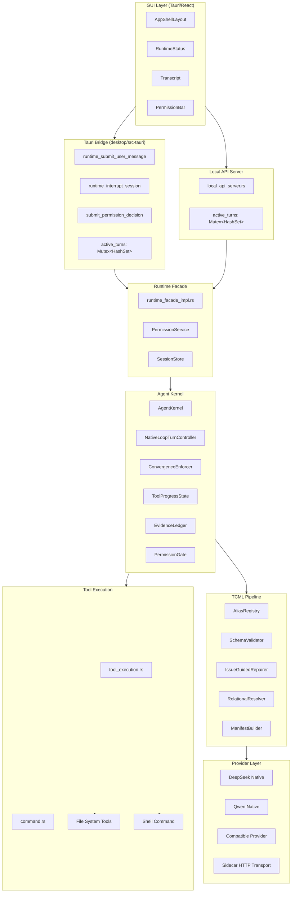
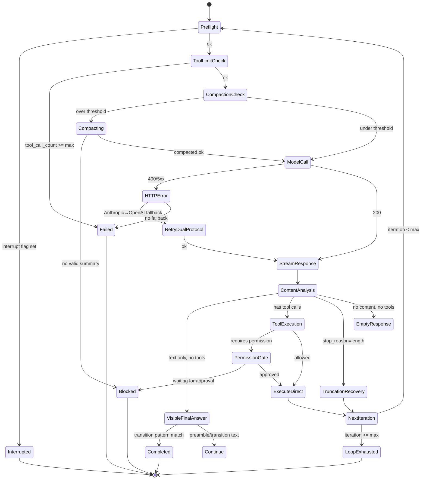
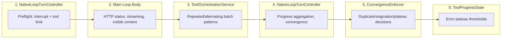
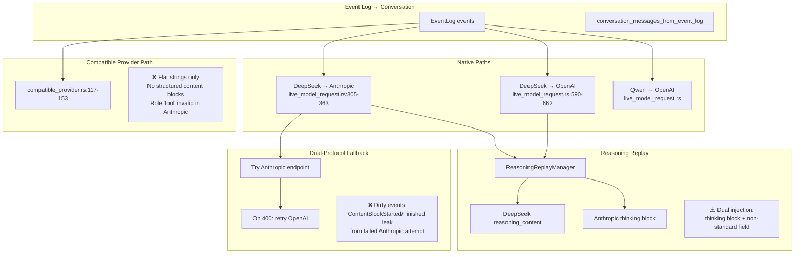
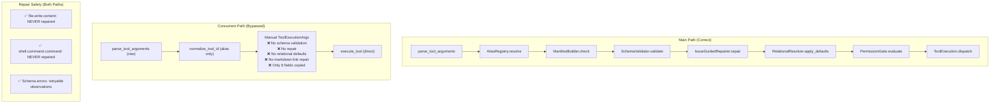
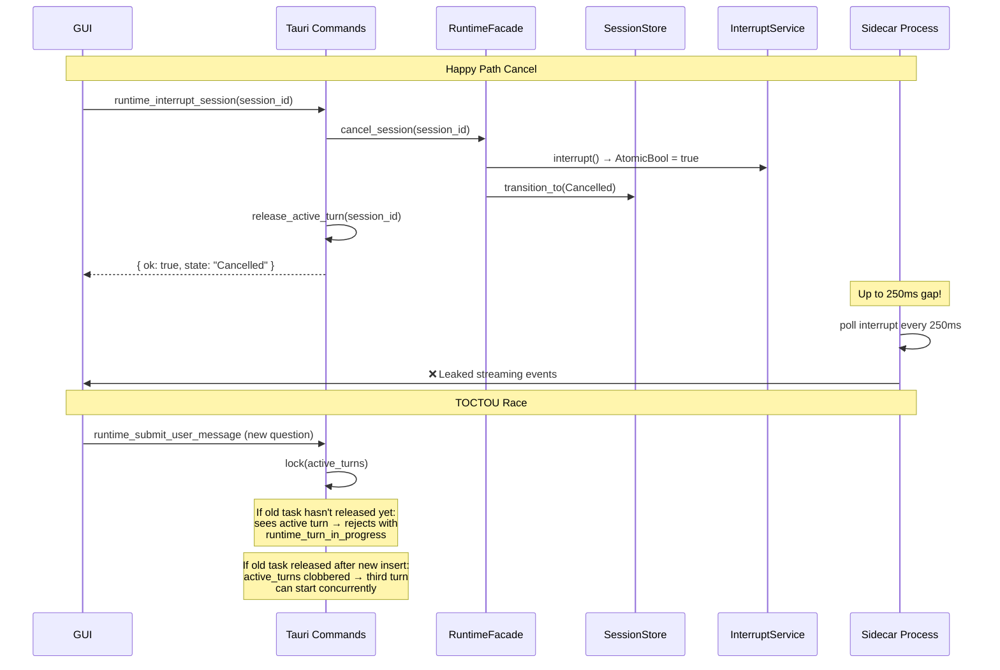
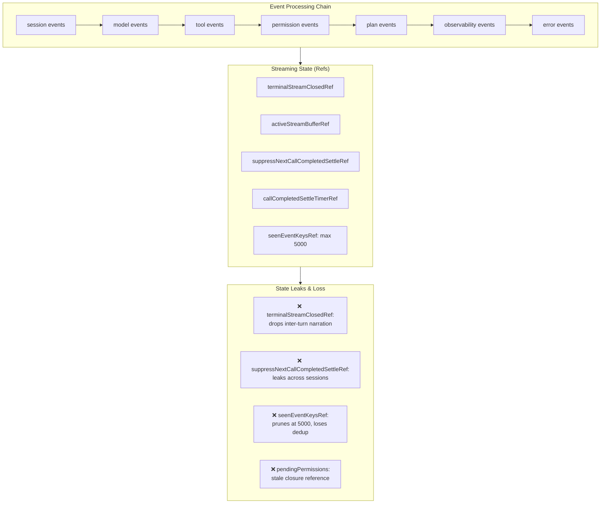

# Phase 4: Architecture Layer-by-Layer Review

## Layer 0: System Topology



## Layer 1: Agent Loop Main Cycle



### Critical Path: 6 Loop Owners



**Issue:** 6 owners with 23 exit paths. No single stop authority. `EscalateToCodeEdit` changes manifest mid-loop between Owner 4-5.

## Layer 2: Event Identity Chain

```mermaid
graph TB
    subgraph Creation["ID Creation Points"]
        TC[tool_call_id<br/>format!: native_loop_v2_tool_{iter}_{idx}]
        PC[provider_tool_call_id<br/>model response or synthetic]
        PM[permission_id<br/>format!: {tc_id}_permission]
        PA[plan_approval_id<br/>format!: {tc_id}_plan_approval]
        LC[ledger_tool_call_id<br/>format!: native_loop_v2_ledger_{iter}_{idx}]
        MC[call_id<br/>session.rs record_model_call_started]
        SC[stream_id<br/>session.rs record_model_stream_delta]
    end

    subgraph Storage["Event Log Storage"]
        EV[EventLog: Vec&lt;KernelEvent&gt;]
        PAYLOAD[Payload carries multiple ID fields]
    end

    subgraph Projection["Conversation Projection"]
        CH[conversation_history.rs]
        OPENAI[OpenAI format: prefers provider_tool_call_id]
        ANTHROPIC[Anthropic format: uses tool_call_id]
    end

    subgraph Merge["Cross-Invocation Merge"]
        MERGE[merge_events_with_id_suffix]
        REWRITE[REWRITABLE_ID_KEYS: id, call_id, stream_id, tool_call_id, provider_tool_use_id]
        MISSING[Missing: permission_id, plan_approval_id]
    end

    subgraph Reverse["Reverse Lookup (Fragile)"]
        REV1[permission_id → tool_call_id: strip_suffix _permission]
        REV2[plan_approval_id → tool_call_id: strip_suffix _plan_approval]
    end

    TC --> EV
    PC --> EV
    PM --> EV
    PA --> EV
    LC --> EV
    MC --> EV
    SC --> EV
    EV --> CH
    EV --> MERGE
    CH --> OPENAI
    CH --> ANTHROPIC
    PM --> REV1
    PA --> REV2
```

**Issues:**
- `ledger_tool_call_id` ≠ `tool_call_id` format (different prefixes, same logical call)
- Merge rewrites 5 ID fields but omits `permission_id` and `plan_approval_id`
- Reverse lookup uses string suffix stripping (fragile, breaks on ID format changes)

## Layer 3: Provider Projection Pipeline



## Layer 4: TCML Pipeline (Main Path vs Concurrent Bypass)



**Critical Gap:** The concurrent path at `native_agent_loop.rs:1719-1789` constructs `ToolExecutionArgs` manually, bypassing 5 of 7 TCML stages. Read-only tools executed concurrently lose all mediation.

## Layer 5: Permission System

```mermaid
graph TB
    subgraph L1["Layer A: Hard Block (Facade)"]
        A1[command_contains_hard_deny]
        A2["Patterns: rm, git push, curl, |, >, $(, .env, id_rsa"]
        A3["Result: BlockedByPolicy — NO user override"]
    end

    subgraph L2["Layer B: Classifier (PermissionGate)"]
        B1[classify_command_with_reasons]
        B2["Priority chain:<br/>1. DENY_SUBSTRINGS<br/>2. Shell operators<br/>3. Network programs<br/>4. Filesystem mutators<br/>5. Sensitive paths<br/>6. Package installs<br/>7. Allowlist"]
        B3["Result: Allow | Ask | AskPackageInstall | Deny"]
        B4["⚠️ Deny → SafetyCheck → Ask<br/>User CAN approve 'denied' commands"]
    end

    subgraph L3["Layer C: PermissionPolicy"]
        C1[TSV persistent rules]
        C2[Session inline rules]
        C3[PermissionMode: Default | DontAsk | Bypass]
        C4["Result: Allow | Ask | Deny"]
    end

    A1 --> A2 --> A3
    B1 --> B2 --> B3 --> B4
    C1 --> C4
    C2 --> C4
    C3 --> C4
```

## Layer 6: Context & Compaction

```mermaid
graph TB
    subgraph Current["Current Implementation"]
        CUR1[Compactor: pure Rust struct]
        CUR2[compact method: EventLog → CompactionResult]
        CUR3[No HTTP client, no model, no endpoint]
        CUR4[CompactionSummary: markdown blob]
        CUR5[reasoning: 240-char preview]
        CUR6["Token estimation: max(chars/4, word_count)"]
    end

    subgraph Doc39["doc39 §12 Target"]
        DOC1[Separate Flash model role]
        DOC2[LLM-based compaction call]
        DOC3[L1 state object: serializable, reconstructable]
        DOC4[Reversible: model can see old events]
        DOC5[Full reasoning_content preserved]
        DOC6[Proper tokenizer-based estimation]
    end

    subgraph Threshold["Threshold: 192K ✅"]
        T1[min(192000, context_window * 3/4)]
        T2[DeepSeek 256K → 192K]
        T3[Correctly implemented]
    end

    CUR1 -.->|gap| DOC1
    CUR3 -.->|gap| DOC2
    CUR4 -.->|gap| DOC3
    CUR5 -.->|gap| DOC5
    CUR6 -.->|gap| DOC6
```

## Layer 7: Active Turn & Cancel Lifecycle



## Layer 8: GUI Event Processing



## Architecture Debt Summary

| Layer | Critical Issue | Severity |
|---|---|---|
| L1: Agent Loop | 6 loop owners, 23 exit paths, mid-loop manifest change | P1 |
| L2: Event Identity | String-based ID reverse lookup, merge omits permission IDs | P1 |
| L3: Provider | Broken compatible Anthropic path, dirty dual-protocol events | P0 |
| L4: TCML | Concurrent path bypasses 5 of 7 stages | P1 |
| L5: Permission | Classifier Deny ≠ true deny, missing dangerous programs | P1 |
| L6: Compaction | No Flash model, no L1 state, irreversible | P0 |
| L7: Cancel | TOCTOU race, 250ms streaming leak | P1 |
| L8: GUI | Narrative loss, cross-session ref leaks, unbounded memory | P2 |
